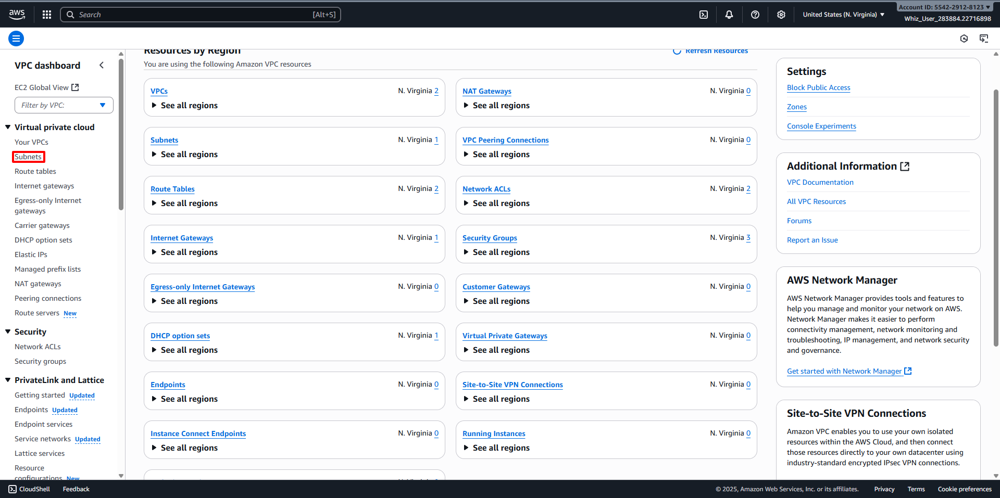
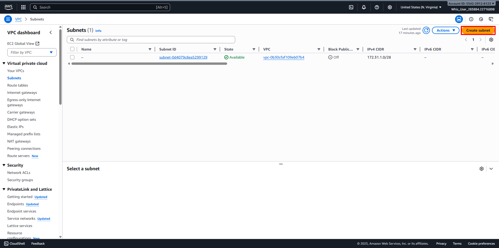
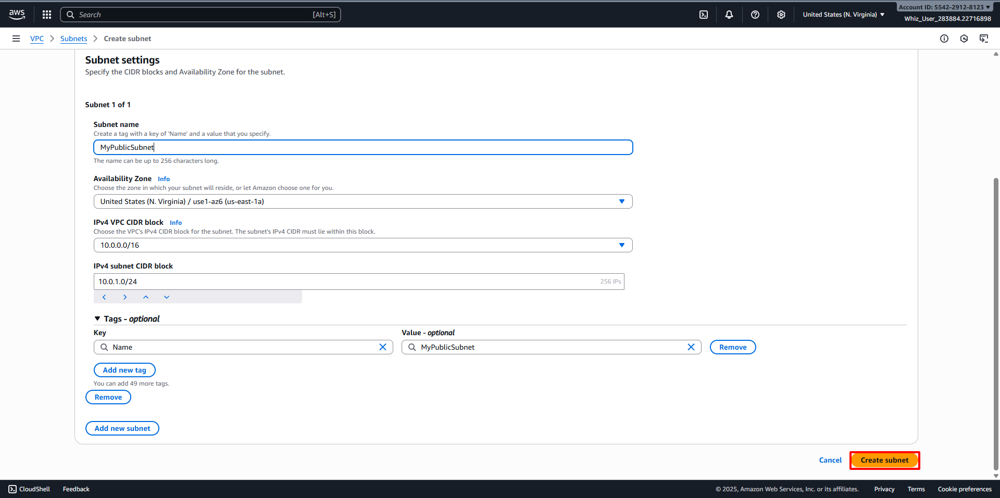
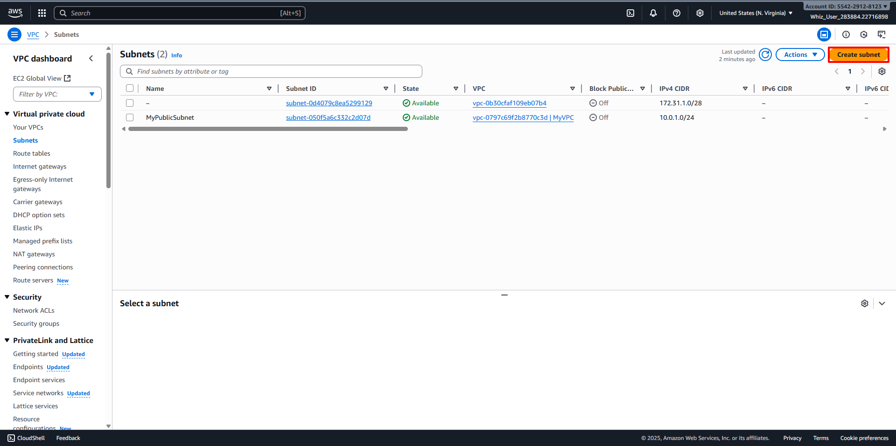
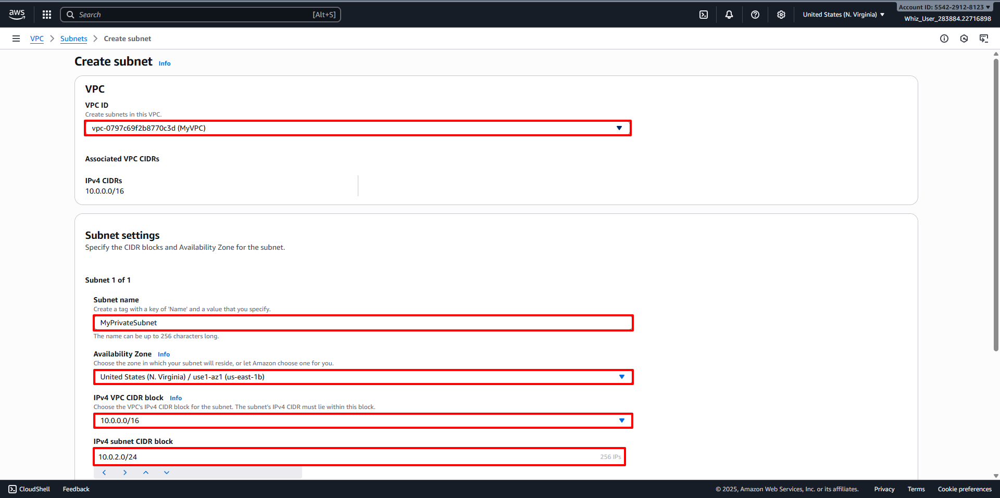
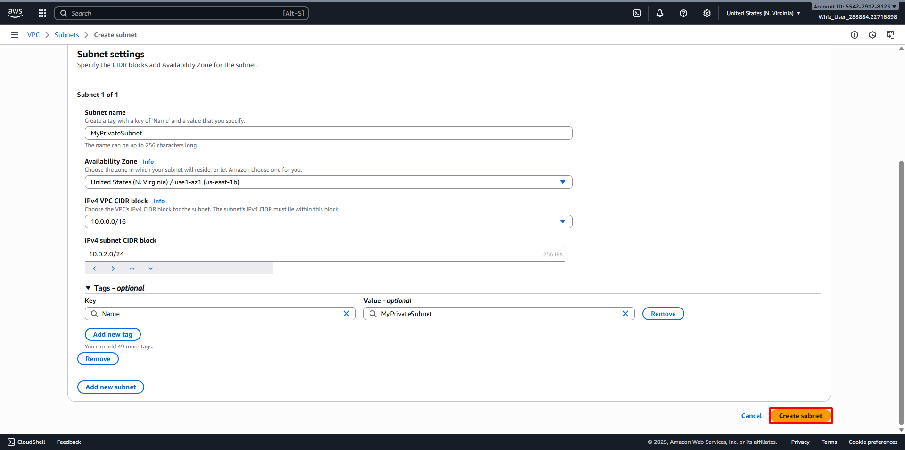
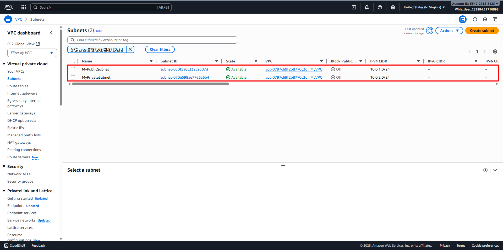

# Creating Subnets
##
1. Back to the VPC Dashboard, then navigate to Subnets in the left panel. 
2. Let's create a Public subnet. Click on Create Subnet button. 
3. Configure the Public subnet:
   - VPC ID: Select your desired VPC (For example MyVPC)
   - Subnet Name: Select your desired name for the Subnet (For example MyPublicSubnet)
   - Availability Zone: Select your desired Availability Zone (For example us-east-1a)
   - IPv4 Subnet CIDR block: Select your desired IPv4 CIDR Block (For example 10.0.1.0/24) 
   - Click on Create subnet button. 
4. Back to Subnets Dashboard then create a private subnet with Click on Create subnet. 
5. Configure the Private subnet:
   - VPC ID: Select your desired VPC (For example MyVPC)
   - Subnet Name: Select your desired name for the Subnet (For example MyPrivateSubnet)
   - Availability Zone: Select your desired Availability Zone (For example us-east-1b)
   - IPv4 Subnet CIDR block: Select your desired IPv4 CIDR Block (For example 10.0.2.0/24) 
   - Click on Create subnet button. 
6. Public and Private Subnets have been Created. 