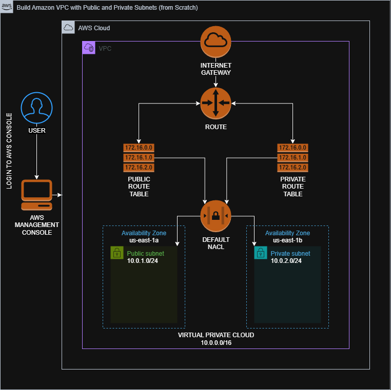

# Build Amazon VPC with Public and Private Subnets (from Scratch)
##
This lab guides you through the process of building a Virtual Private Cloud (VPC) environment within Amazon Web Services (AWS). The objective is to help users gain hands-on experience with the core elements of VPC architecture by manually assembling each component—rather than relying on the automated VPC Wizard. Through a detailed walkthrough, you'll learn how to configure public and private subnets, set up routing and connectivity, and understand how each part contributes to a secure and functional cloud network. This approach offers deeper insight into the mechanics of VPCs and the relationships between their internal resources.
###
Diagram:
###

###
Steps:
1. [Sign in to AWS Management Console](SignIn.md)
2. [Creating New VPC](Create_VPC.md)
3. [Creating Subnets](Create_Subnet.md)
4. [Create and configure Internet Gateway](Create_Internet_Gateway.md)
5. [Create Route Tables](Create_Route_Table.md)