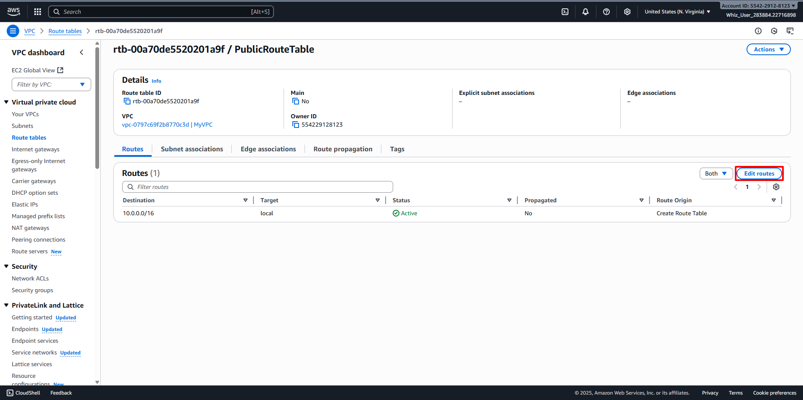

# Create Route Tables
##
Public Route Table
##
###
1. Back to the VPC Dashboard, then navigate to Route Tables in the left panel. 
2. Let's create a Public Route Table. Click on Create Route Table button. 
3. Configure the Public Route Table:
   - Name: Enter desired name for Route Table (For example PublicRouteTable).
   - VPC: Select desired VPC (For example MyVPC).
   - Click on Create Route Table. 
4. Attach an Internet Gateway to the Route Table.
   - In the Routes Tab, click on Edit Routes. 
   - Click Add Route:
     + Destination: Enter desired IP Address range (CIDR block) that traffic is intended for (For example 0.0.0.0/0).
     + Target: Select Internet Gateway, then choose your desired Internet Gateway (For example MyInternetGateway).
     + Click on Save Changes. 
5. Associate the Subnet to the Route Table.
    - In the Subnet Associations Tab, click on Edit Subnet Associations. 
    - Select your desired Subnet (For example MyPublicSubnet).
    - Then click on Save Associations button. 
6. Once all the configurations are completed, it should look like below:
       - Now the Instances launched within MyPublicSubnet will have access to the Internet.
       - There is another existing route table already available for MyVPC. It is the main route table created at the time the VPC was created. 
##
Private Route Table
##
###
1. Back to the VPC Dashboard, then navigate to Route Tables in the left panel. 
2. Let's create a Private Route Table. Click on Create Route Table button. 
3. Configure the Public Route Table:
   - Name: Enter desired name for Route Table (For example PrivateRouteTable).
   - VPC: Select desired VPC (For example MyVPC).
   - Click on Create Route Table. 
4. Associate the Subnet to the Route Table.
    - In the Subnet Associations Tab, click on Edit Subnet Associations. 
    - Select your desired Subnet (For example MyPrivateSubnet).
    - Then click on Save Associations button. 
5. Once all the configurations are completed, it should look like below:
       - Now the Instances launched within MyPrivateSubnet will not have access to the Internet.
       - There is an existing route table already available for MyVPC. It is the main route table created at the time the VPC was created. 