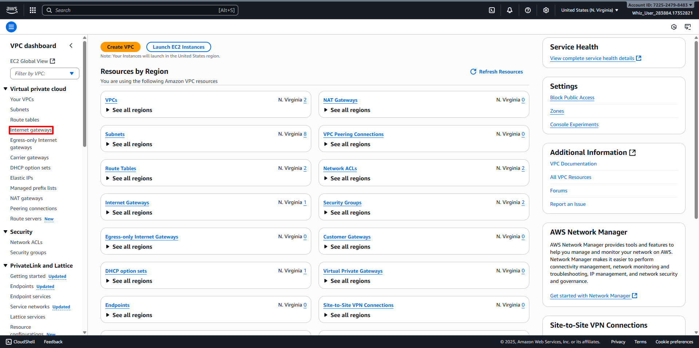
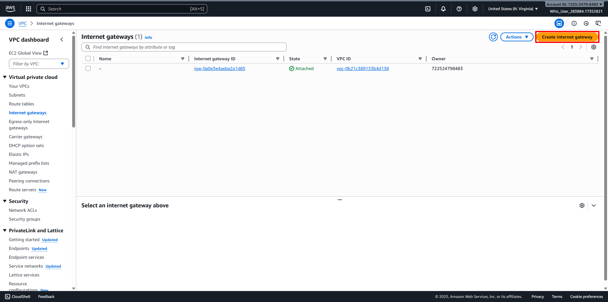
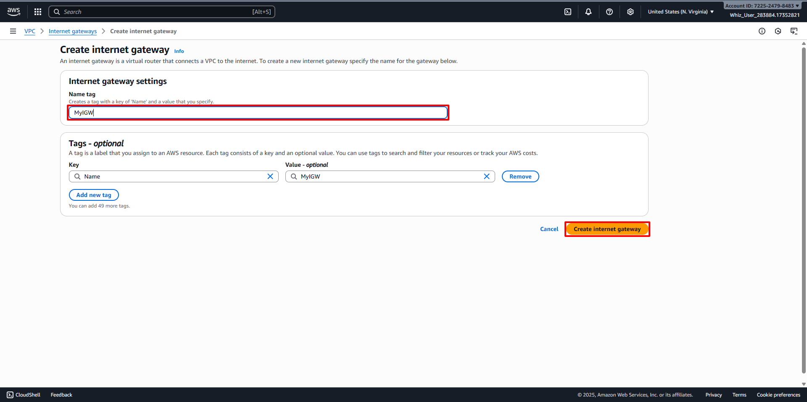
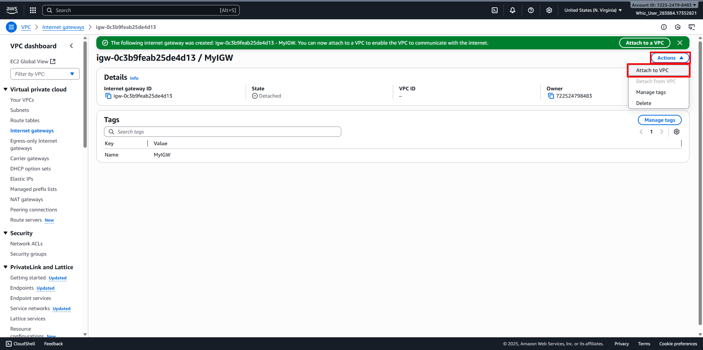
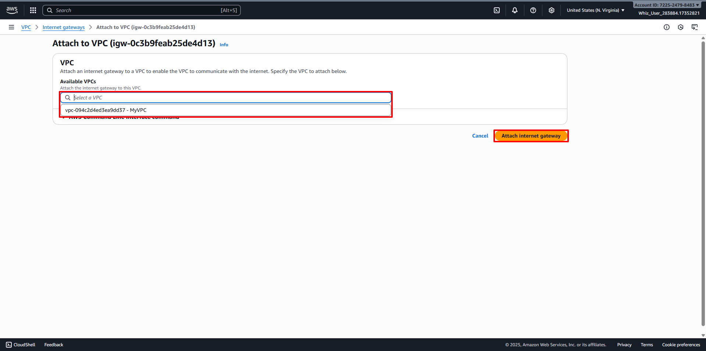
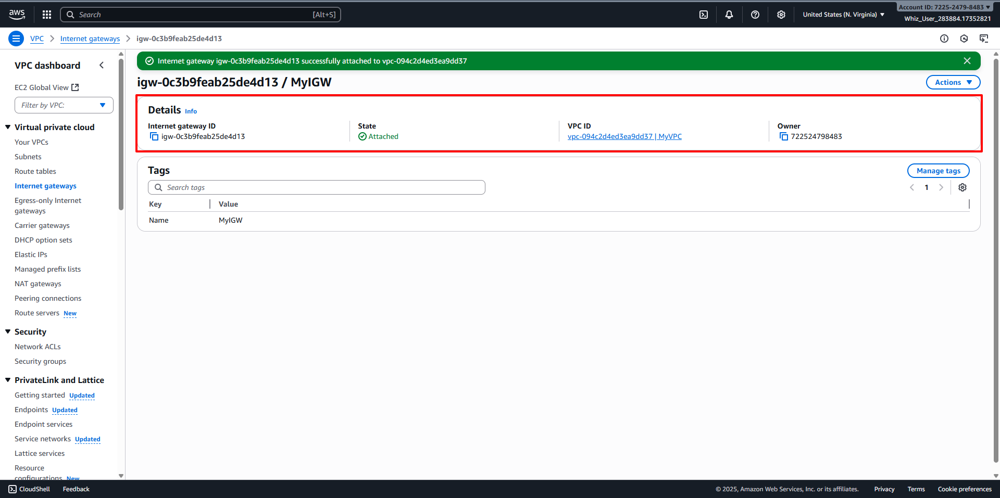

# Create Internet Gateway
##
1. Back to the VPC Dashboard, then navigate to Internet Gateways in the left panel. 
2. Click on the Create Internet Gateway button. 
   - Name tag: Enter desired name for Internet Gateway (For example MyIGW).
   - Click on the Create Internet Gateway button. 
3. Internet Gateway has been created. Then Attach the Internet Gateway to the VPC. 
   - Click on Actions, then Select Attach to VPC. 
   - VPC: Select desired VPC (For example MyVPC).
   - Click on Attach internet gateway. 
4. Internet Gateway has been attached to the VPC. 
