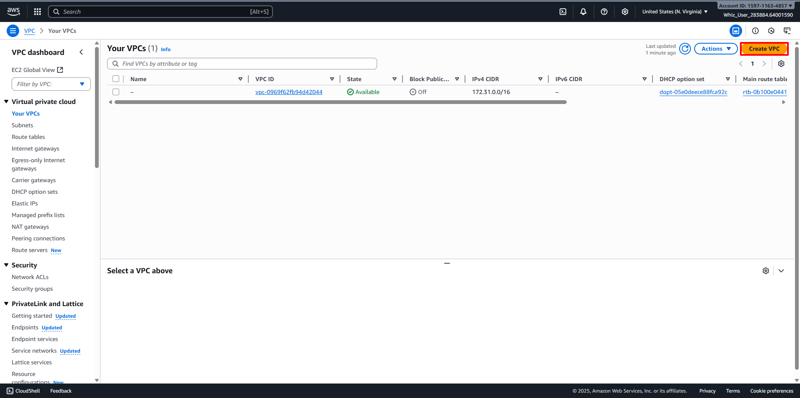
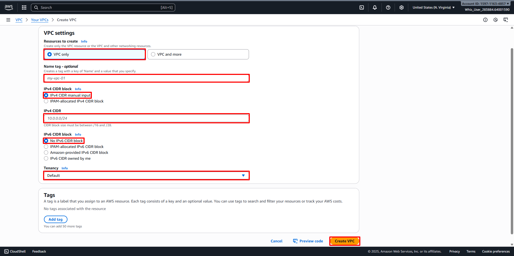
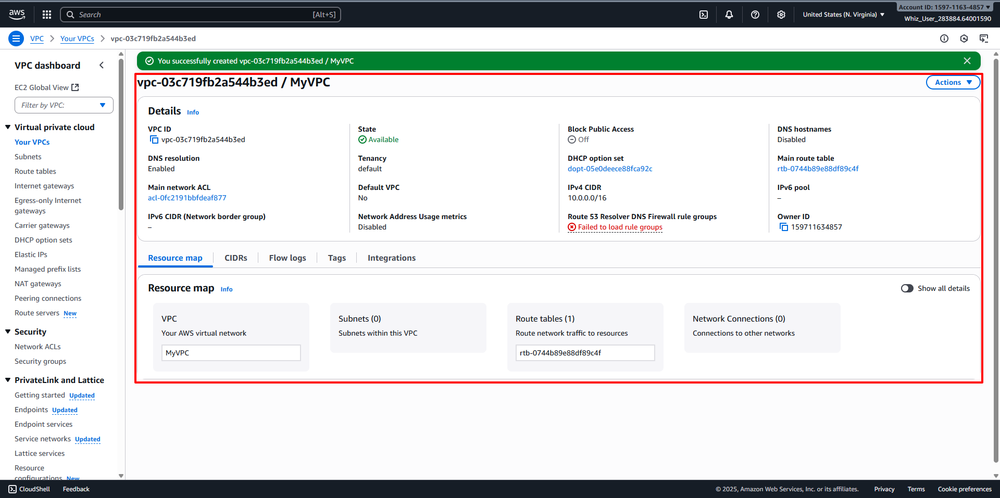

# Create a VPC
##
1. AWS Management Console Dashboard. 
2. Type VPC in the Search Bar. 
3. Or click on Services and select VPC under the Networking & Content Delivery section. 
4. In the VPC dashboard, select the Your VPCs option in the left panel. 
5. Click on the Create VPC button to create a new VPC. 
6. Configure the VPC:
   - Resource to create: Select VPC Only.
   - Name Tag: Enter desired name for the VPC (For example MyVPC)
   - IPv4 CIDR block: Enter desired CIDR range (For example 10.0.0.0/16).
   - IPv6 CIDR block: Select No IPv6 CIDR Block.
   - Tenancy: Default.
   - Then click Create VPC button. 
7. VPC Creation has been Done. 
