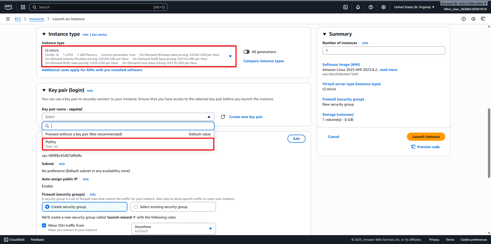
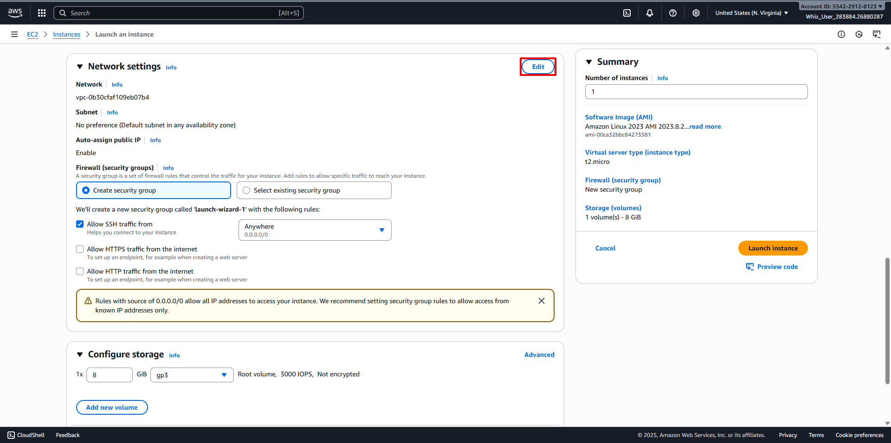
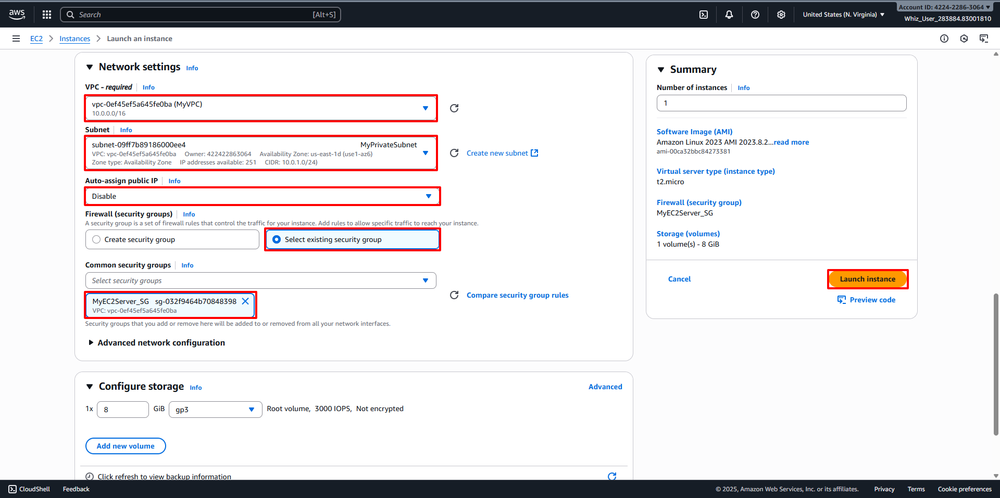
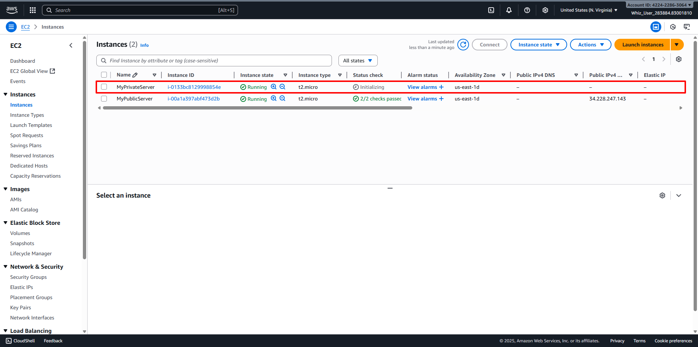
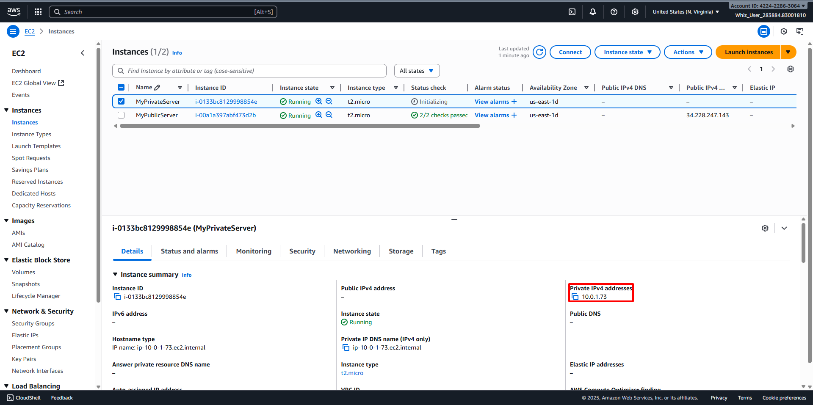

# Launch an EC2 Instance in Private Subnet
##
1. Back to AWS Management Console Dashboard, then type EC2 in the Search Bar. 
2. Or click on Services and select EC2 under the Compute section. 
3. In the EC2 dashboard, select the Your VPC option in the left panel. 
4. Configure your Instance:
   - Name: Enter your desired name for your Instance (For example MyPrivateServer)
   - For Amazon Machine Image (AMI): Select your desired Operating System and Version (For example Amazon Linux 2023 kernel-6.1 AMI). 
   - Instance Type: Select your desired Instance Type (For example t2.micro).
   - Select Key Pair that you created before (For example MyKey). 
   - Edit Network Settings: 
     + VPC: Select your desired VPC (For example MyVPC)
     + Subnet: Select your desired Subnet (For example MyPrivateSubnet)
     + Auto-assign public IP: Disable
     + Select Existing Security Group
     + Select Security Group that you created before (For example MyEC2Server_SG)
   - Keep Rest thing Default and Click on Launch Instance Button. 
5. Select View all Instances to View Instance you Created. 
6. Launch Status: Your instance is now launching, Select the instance and wait for it to change status to Running. 
7. Note the Private IP Address of MyPrivateServer (For example 10.0.1.73). 

