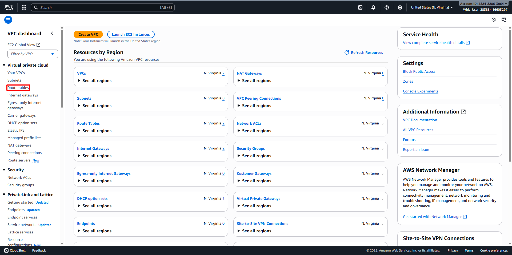
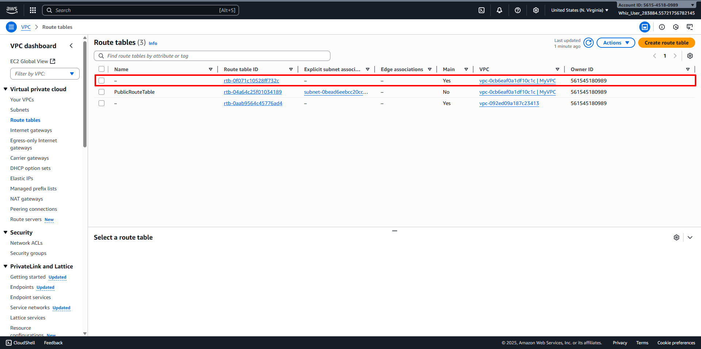
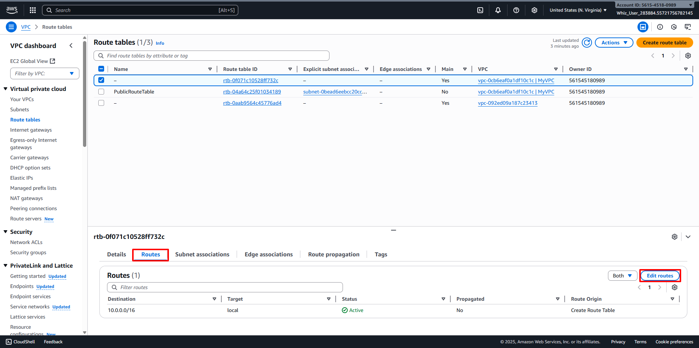
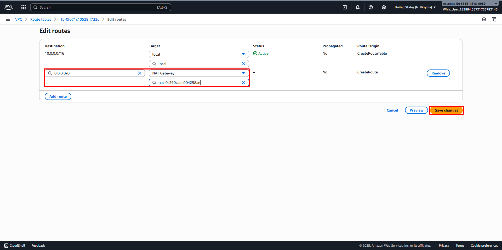
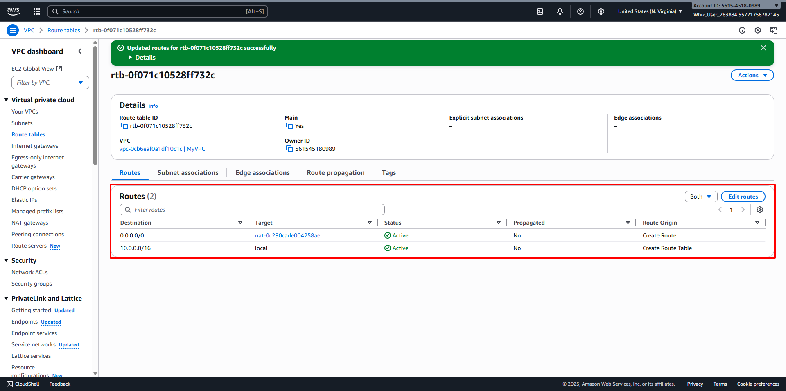

# Update Route table and configure NAT Gateway
##
1. Back to the VPC Dashboard, then navigate to Route Tables in the left panel. 
2. You can see two Route Tables available for MyVPC, then select the Main Route Table (which is different from the one created by you). 
3. Configure the Route Table by clicking on the Route Tab:
   - Click on Edit routes. 
   - Click on Add route button.
   - Destination: Enter 0.0.0.0/0
   - Target: Select NAT Gateway, and once the internet gateways have loaded, select the NAT Gateway you created (For example MyNATGateway).
   - Click on Save changes button. 
4. Once all the configurations are completed, it should look like below. 

