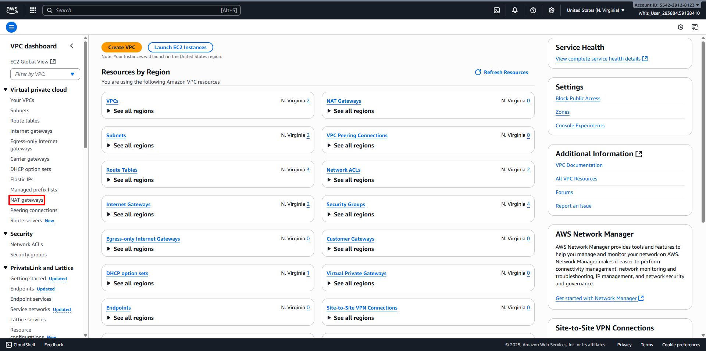
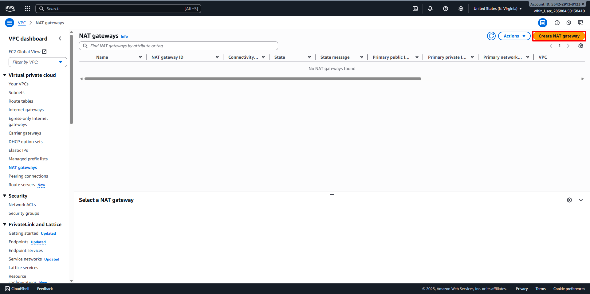
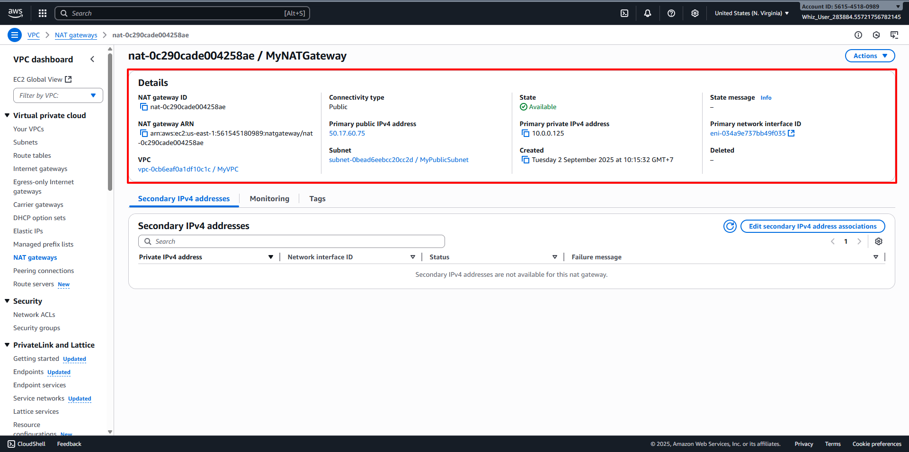

# Create a NAT Gateway
##
1. Back to the VPC Dashboard, then navigate to NAT Gateways in the left panel. 
2. Click on Create NAT Gateway button. 
3. Configure the NAT Gateway
   - Name: Enter your desired name for NAT Gateway (For example MyNATGateway)
   - Subnet: Choose your created subnet before (For example MyPublicSubnet in MyVPC)
   - Elastic IP Allocation ID: Click on Allocate Elastic IP to Generate Elastic IP Allocation ID.
   - Once the new Elastic IP is allocated, click on Create NAT gateway button. 
4. Make sure your NAT Gateway created in a Public Subnet.
5. NAT Gateway will be created in a few minutes. Once created, the status will change to Available. 
