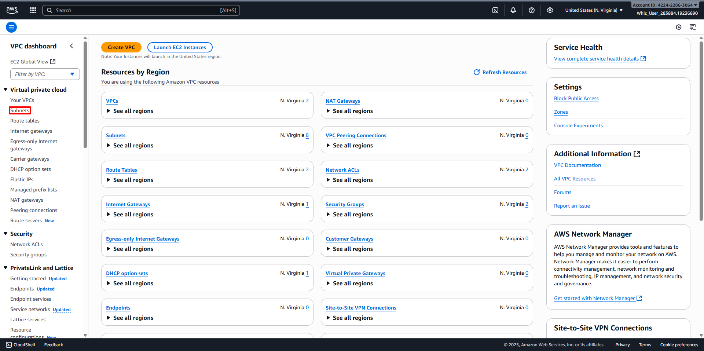
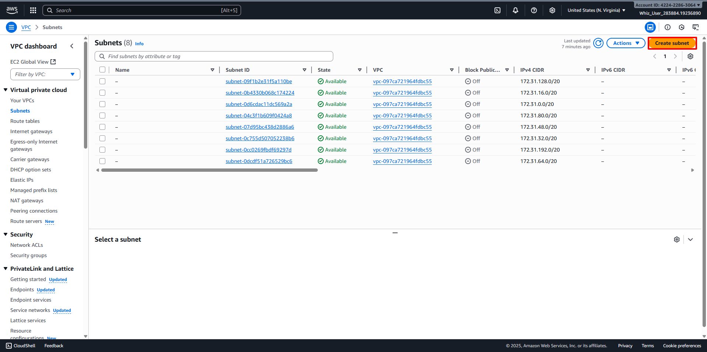
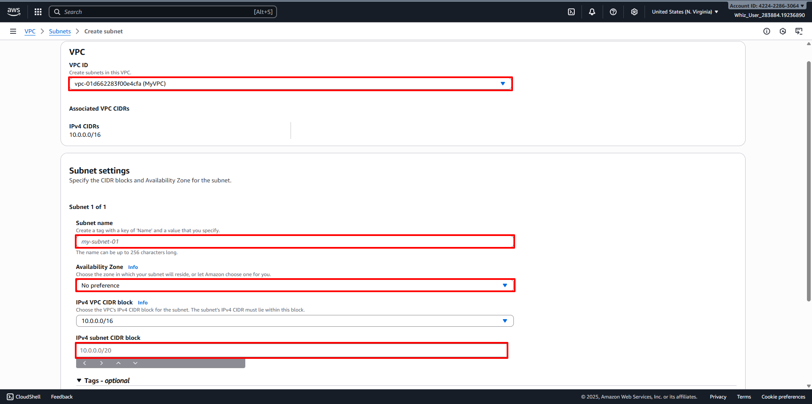
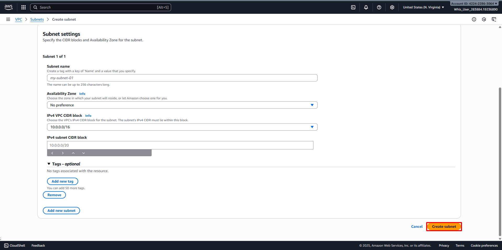
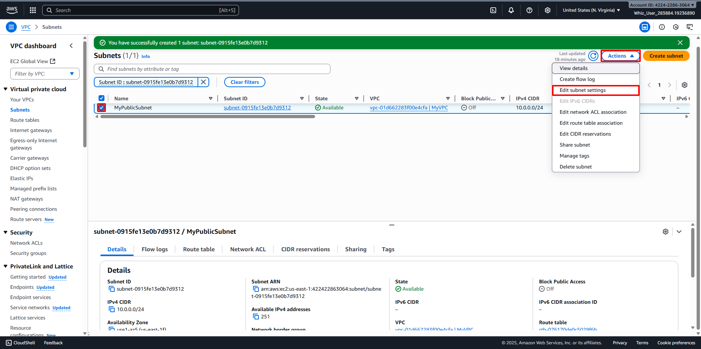
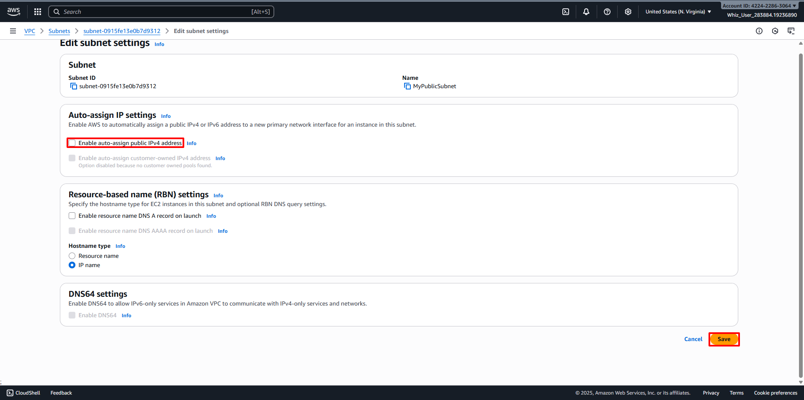
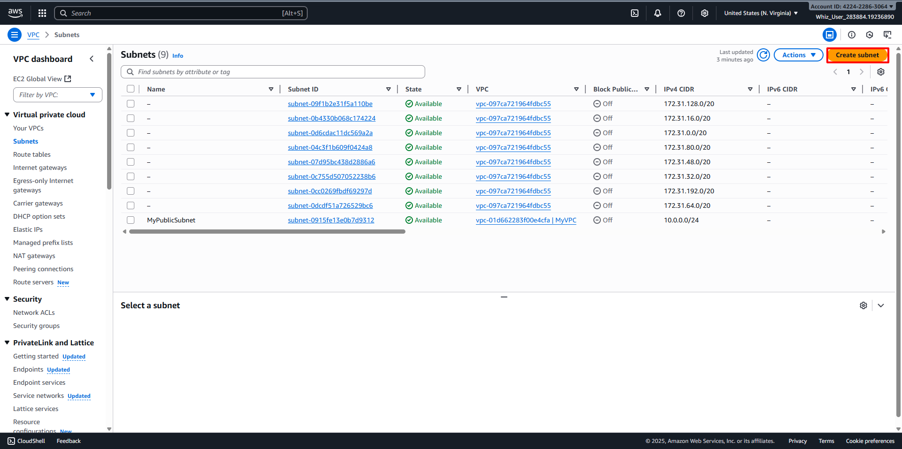
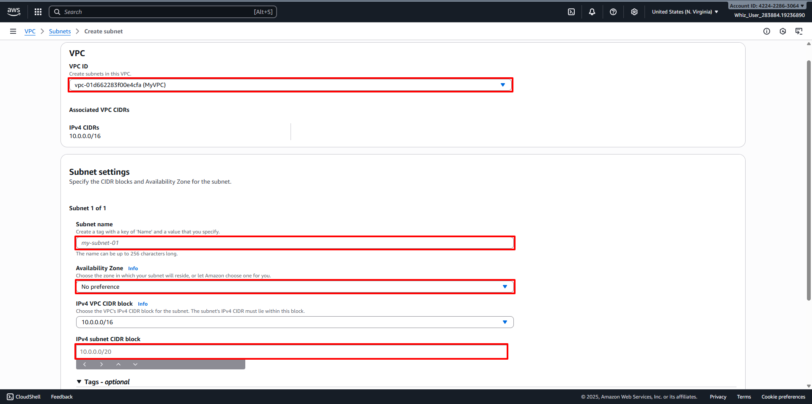
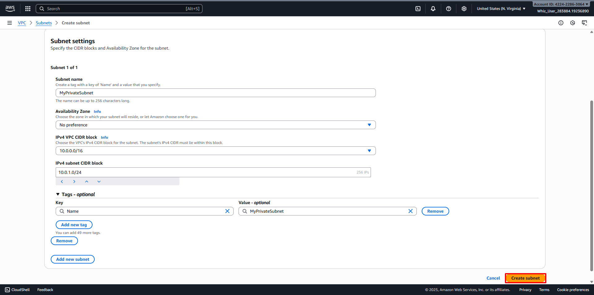
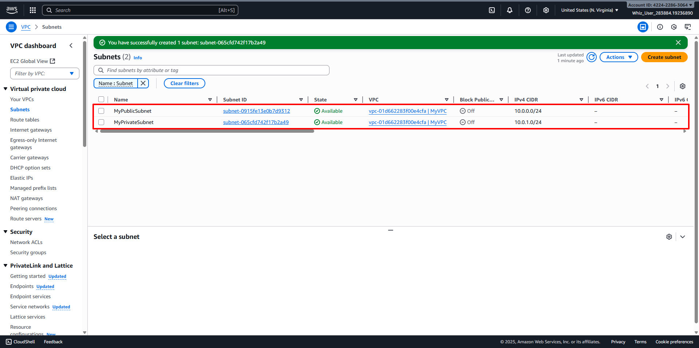

# Create Public and Private Subnets
##
1. Back to the VPC Dashboard, then navigate to Subnets in the left panel. 
2. Let's create a Public subnet. Click on Create Subnet button. 
3. Configure the Public subnet:
   - VPC ID: Select your desired VPC (For example MyVPC)
   - Subnet Name: Select your desired name for the Subnet (For example MyPublicSubnet)
   - Availability Zone: Select your desired Availability Zone (For example No Reference)
   - IPv4 Subnet CIDR block: Select your desired IPv4 CIDR Block (For example 10.0.0.0/24) 
   - Click on Create subnet button. 
4. Enable Auto Assign public IP to Instances created within this subnet:
   - Select you desired Subnet (For example MyPublicSubnet), Click on Actions.
   - Click on Edit subnet settings. 
   - Enable auto-assign public IPv4 address: Check
   - Click on Save.
5. Now, the Instances launched inside the MyPublicSubnet will have Public IPs assigned to them by default.
6. Let’s create a private subnet. Click on Create subnet. 
7. Configure the Private subnet:
   - VPC ID: Select your desired VPC (For example MyVPC)
   - Subnet Name: Select your desired name for the Subnet (For example MyPrivateSubnet)
   - Availability Zone: Select your desired Availability Zone (For example No Reference)
   - IPv4 Subnet CIDR block: Select your desired IPv4 CIDR Block (For example 10.0.1.0/24) 
   - Click on Create subnet button. 
8. Public and Private Subnets have been Created. 
