# Launch an EC2 Instance in Public Subnet
##
1. Back to AWS Management Console Dashboard, then type EC2 in the Search Bar. 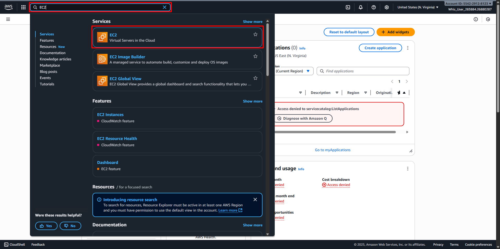
2. Or click on Services and select EC2 under the Compute section. 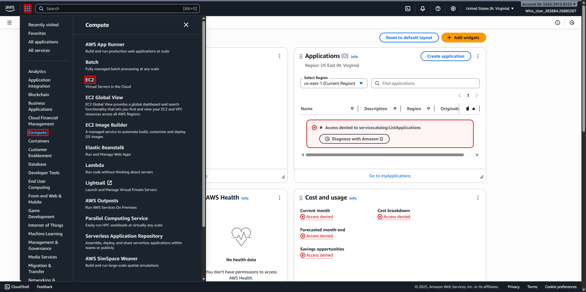
3. In the EC2 dashboard, select the Instances option in the left panel and click Launch Instances. 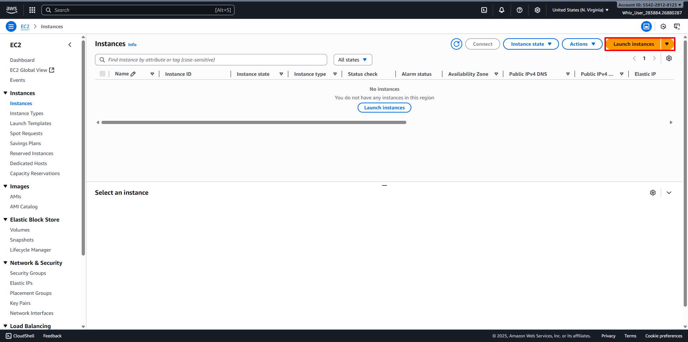
4. Configure your Instance:
   - Name: Enter your desired name for your Instance (For example MyPublicServer)
   - For Amazon Machine Image (AMI): Select your desired Operating System and Version (For example Amazon Linux 2023 kernel-6.1 AMI). 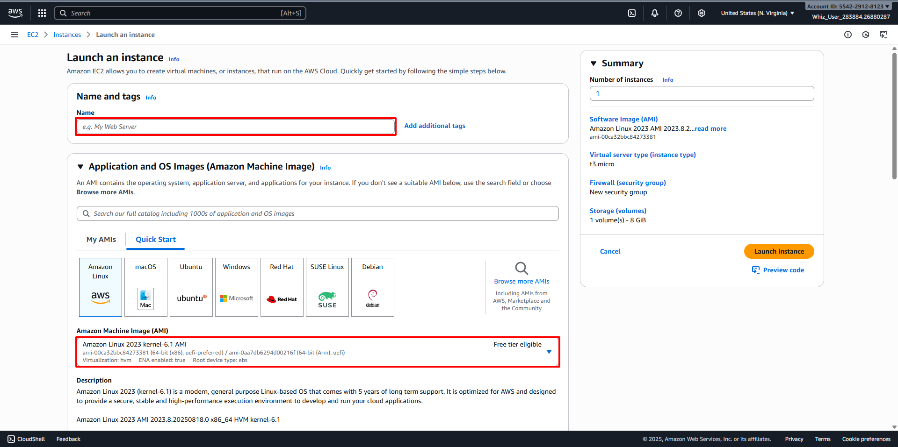
   - Instance Type: Select your desired Instance Type (For example t2.micro).
   - Create a new Key Pair, then Configure it: 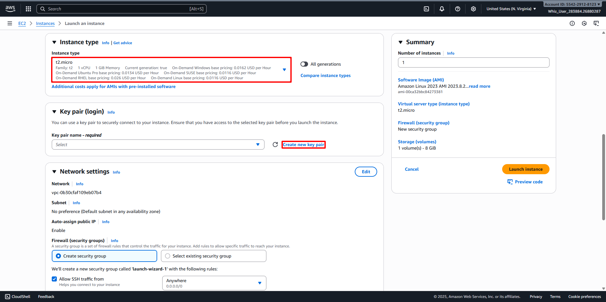
     + Key Pair name: MyKey
     + Key Pair type: RSA
     + Private Key file format: .pem 
     + Click on the Create Key Pair button. 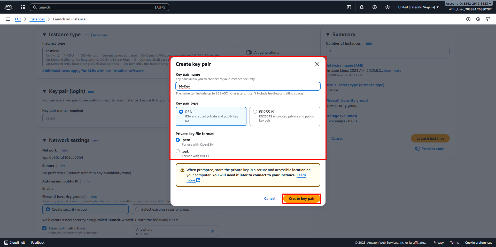
   - Edit Network Settings: 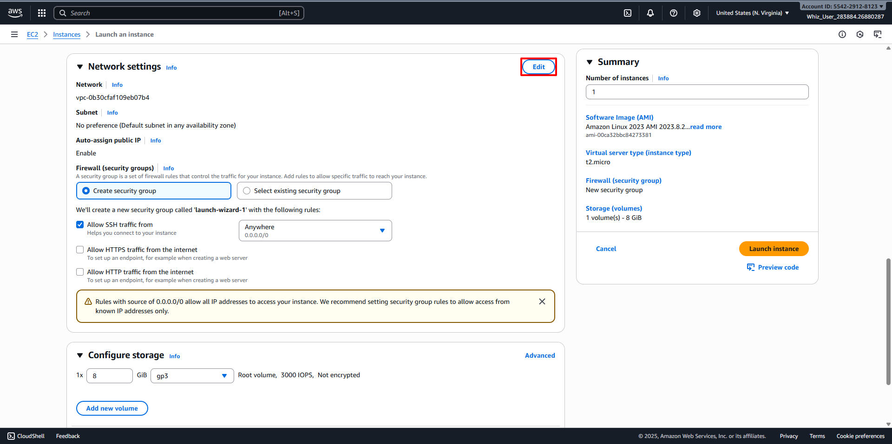
     + VPC: Select your desired VPC (For example MyVPC)
     + Subnet: Select your desired Subnet (For example MyPublicSubnet)
     + Auto-assign public IP: Enable
     + Select Create new Security group
     + Security group name: Enter desired name for Security Group (For example MyEC2Server_SG)
     + Description: Enter desired description for Security Group (For example Security Group to allow traffic to EC2)
     + Inbound Security Group Rules:
       - Type: SSH
       - Source Type: Anywhere 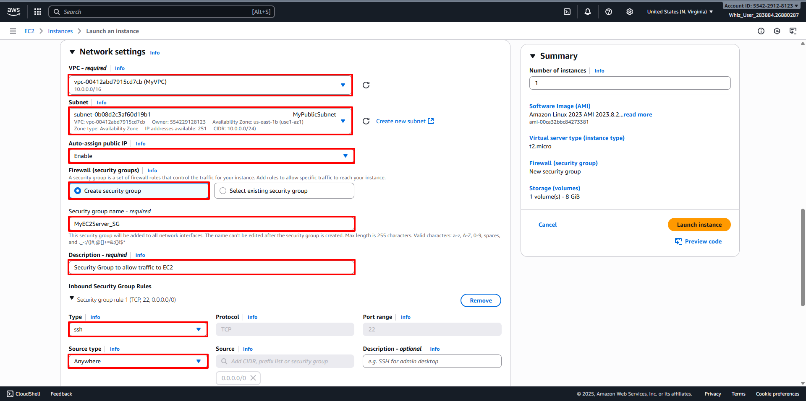
   - Keep Rest thing Default and Click on Launch Instance button. 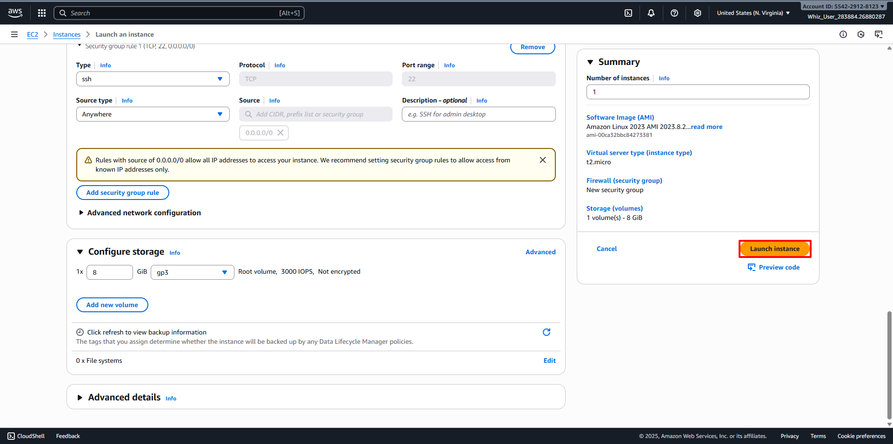
5. Select View all Instances to View Instance you Created. 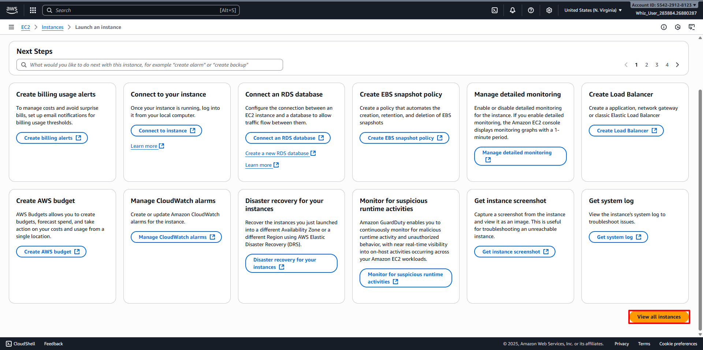
6. Launch Status: Your instance is now launching, Select the instance and wait for it to change status to Running. 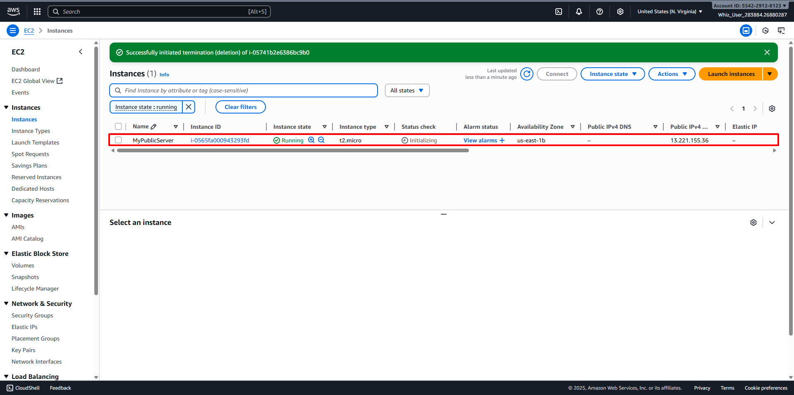
