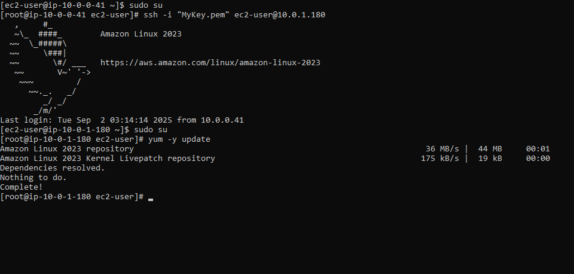

# Test Internet connection from Instance inside Private Subnet
##
1. SSH back into MyPublicEC2Server.
2. Switch to root user.
   ```bash
   sudo su
   ```
3. SSH into MyPrivateEC2Server. (For example 10.0.1.180)
   ```bash
   ssh  ec2-user@<Private IP of MyPrivateEC2Server> -i MyKey.pem
   ```
4. Switch to root user.
   ```bash
   sudo su
   ```
5. Run the updates using the following command:
   ```bash
   yum -y update
   ```
6. You can see that the updates have been completed successfully in the terminal. 
7. This shows that MyPrivateEC2Server has internet access.
8. Close the private server connection.
   ```bash
   exit
   ```
