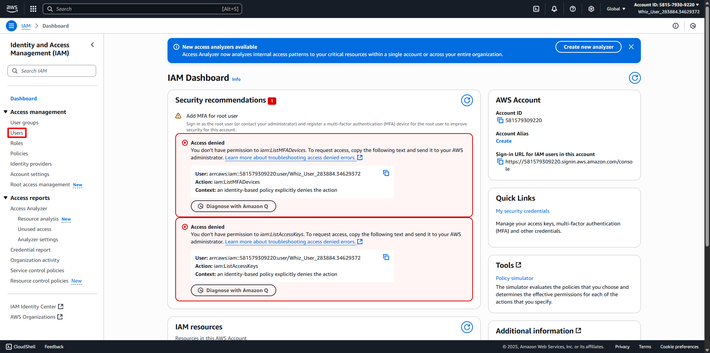
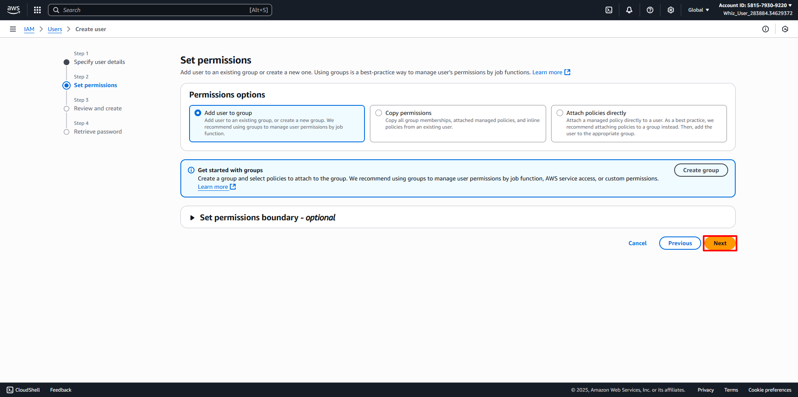
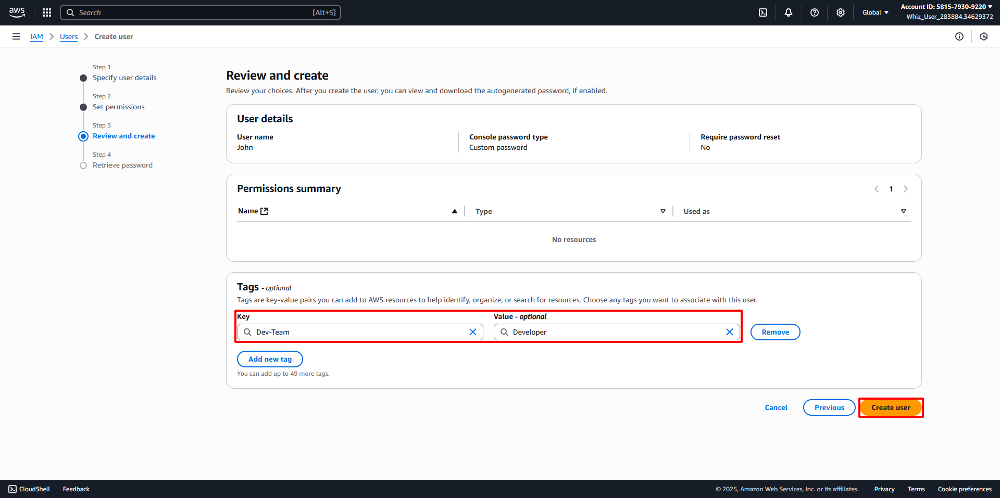

# Create IAM
##
1. AWS Management Console Dashboard. 
2. Type IAM in the Search Bar. 
3. Or click on Services and select IAM under the Security, Identity, & Compliance section. 
4. In the IAM dashboard, select the Users option in the left panel. 
5. Click on the Create User button to create a new IAM user. 
6. In the Add Users page, fill in the User Details section as follows:
   - User name: Enter the desired name for the user.
   - Check the Provide user access to the AWS Management Console - optional checkbox.
   - Select Custom password under Console Password and enter the desired Password for the User.
   - Uncheck the Users must create a new password at the next sign-in (recommended) checkbox.
   - Click the Next button.
7. In the Set permissions section, keep things as the default. Click on the Next button. 
8. Review the configuration that you created before. Find Tags and click the Add New Tag button. 
   - Key: Enter your desired Key (For example Dev-Team)
   - Value: Enter your desired Value (For example Developers)
   - Click Create User 
9. Note: Ignore the above error if it appears while creating Users.
   - Click Close, then Click on the Return to users list button. 
   - Lastly Click Continue button. 
10. User Creation has been Done. 
