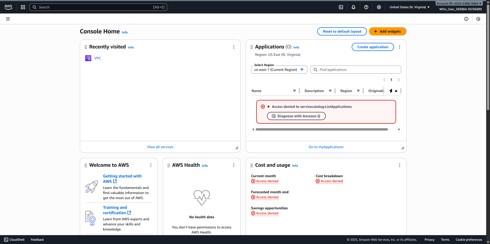
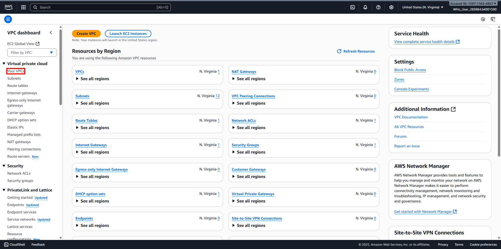
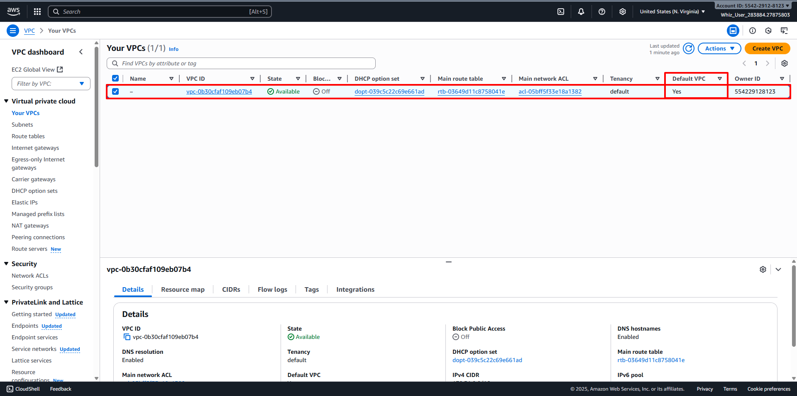
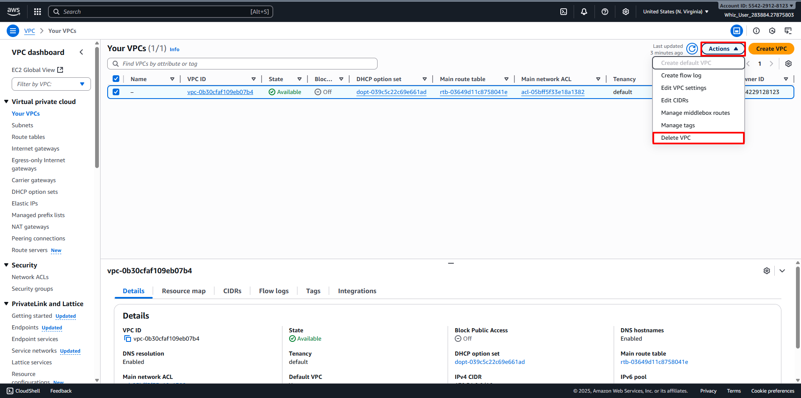
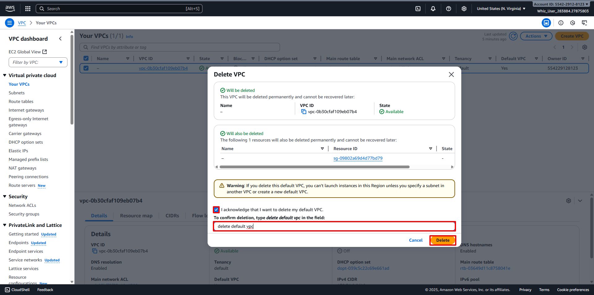
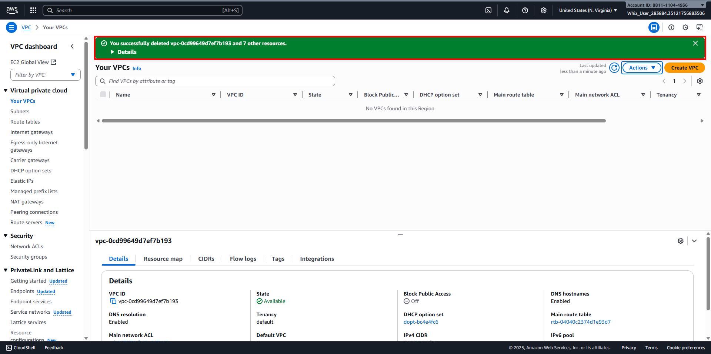
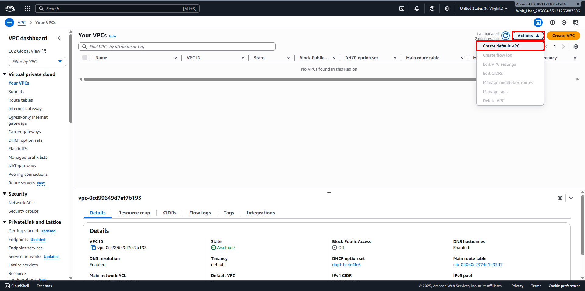
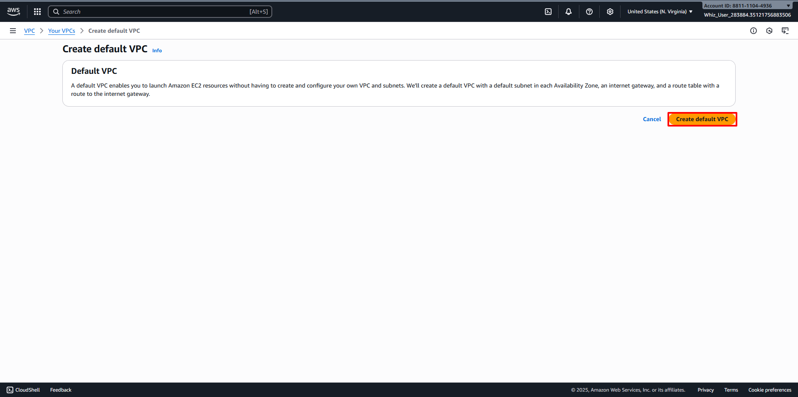
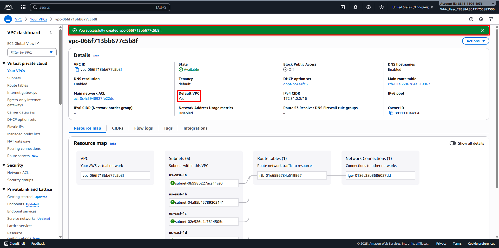

# Provision Default VPC
##
1. AWS Management Console Dashboard. 
2. Type VPC in the Search Bar. 
3. Or click on Services and select VPC under the Networking & Content Delivery section. 
4. In the VPC dashboard, select the Your VPCs option in the left panel. 
5. Delete Default VPC,
    - Select the Default VPC. 
    - Click on the Actions button and select Delete VPC option. 
    - Check I acknowledge that I want to delete my default VPC option.
    - Type "Delete Default VPC"
    - Confirm the deletion by Delete button. 
    - VPC has been deleted. 
6. Create Default VPC,
    - Click on the Actions button and select Create Default VPC. 
    - Click on the Create Default VPC button. 
    - Your Default VPC has been created. 