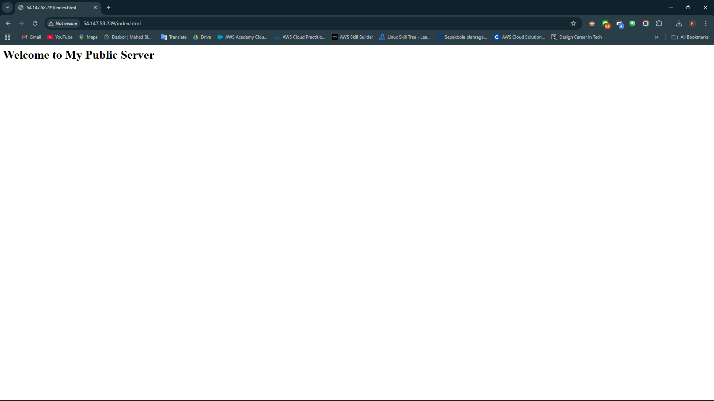

# Create a web page and publish it on the instance
##
1. Add contents into index.html file using echo command.
``` bash
echo "<h1>Welcome to My Public Server</h1>" > /var/www/html/index.html
```
2. Make sure your file created with using listing command.
``` bash
ls /var/www/html/index.html
```
3. Restart the webserver.
``` bash
systemctl restart httpd
```

4. Now enter the file name, /index.html after the public IPv4 Address which you got when you created the ec2 instance in the browser, and you can see your HTML content.
   - Make sure URL Protocol is http not https.
   - Syntax: http://<Your_Public_IPv4_Address>/index.html
   - Sample URL: http://54.147.58.239/index.html
   - Note: If the index.html page is not loading, try removing s from the link, it should be HTTP.


