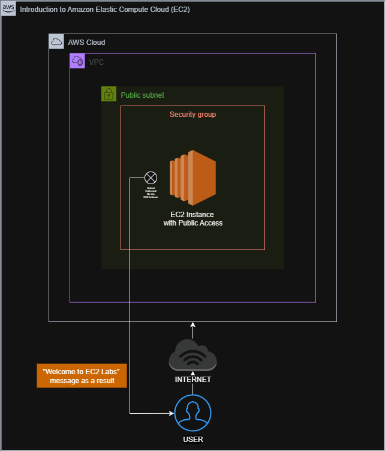

# Introduction to Amazon Elastic Compute Cloud (EC2)
## 
This lab guides you through the process of launching Amazon EC2 instances using Amazon Machine Images (AMI) and configuring secure access through SSH key pairs. The lab aims to familiarize users with the fundamentals of EC2 provisioning and authentication, and provides a step-by-step demonstration of creating and publishing a web page on an AWS virtual machine.
Diagram:

###
1. [Sign In to AWS Management Console](SignIn.md)
2. [Provision Default VPC]
3. Launch an EC2 Instance with desired specifications
4. SSH into EC2 Instance using the Key Pair
5. Install an Apache Server on the Instance
6. Create a web page and publish it on the instance