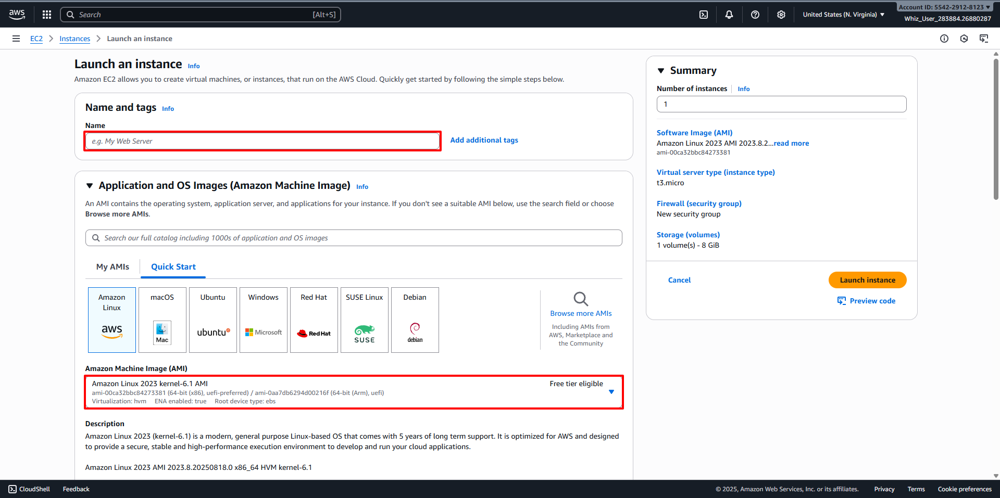

# Launch an EC2 Instance with desired specifications
##
1. Back to AWS Management Console Dashboard, then type EC2 in the Search Bar. 
2. Or click on Services and select EC2 under the Compute section. 
3. In the EC2 dashboard, select the Instances option in the left panel and click Launch Instances. 
4. Configure your Instance:
   - Name: Enter your desired name for your Instance (For example MyPublicServer)
   - For Amazon Machine Image (AMI): Select your desired Operating System and Version (For example Amazon Linux 2023 kernel-6.1 AMI). 
   - Instance Type: Select your desired Instance Type (For example t2.micro).
   - Create a new Key Pair, then Configure it: 
     + Key Pair name: MyKey
     + Key Pair type: RSA
     + Private Key file format: .pem 
     + Click on the Create Key Pair button. 
   - Edit Network Settings: 
     + Auto-assign public IP: Enable
     + Select Create new Security group
     + Security group name: Enter desired name for Security Group (For example MyEC2Server_SG)
     + Description: Enter desired description for Security Group (For example Security Group to allow traffic to EC2)
     + Inbound Security Group Rules:
            - Click on Add Security Group Rule
            - Type: HTTP
            - Source Type: Anywhere 
   - Keep Rest thing Default and Click on Launch Instance button. 
5. Security Group is a virtual firewall that controls the inbound and outbound traffic for instances in a particular network in a cloud computing environment. Here we have selected SSH and HTTP rules that will allow incoming SSH and HTTP traffic to instances that are associated with the security group.
6. Click View All Instances button to View Instance you Created. 
7. Launch Status: Once you have initiated the instance launch process, Go to the Instances page from the left menu and wait for your EC2 instance to become "Running" while ensuring the health check status is 2/2 checks passed for optimal performance.
8. Select the instance that you have created and copy the public IPv4 address within the details section and paste it into the editor for later use. An example of this process is depicted in the screenshot provided. 