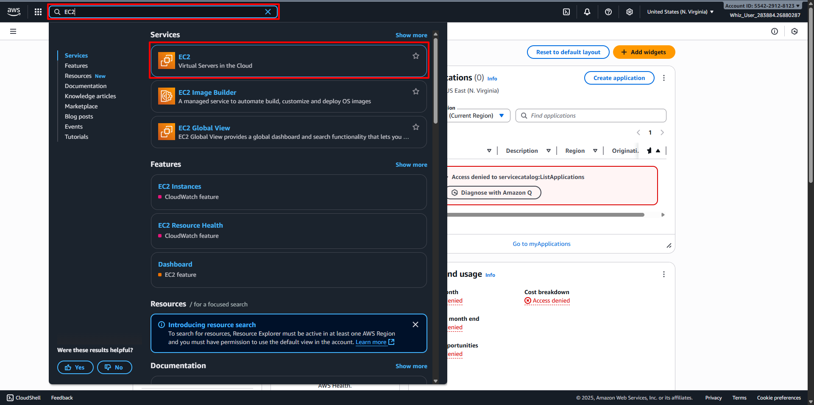

# Launch an EC2 Instance with desired specifications
##
1. Back to AWS Management Console Dashboard, then type EC2 in the Search Bar. 
2. Or click on Services and select EC2 under the Compute section. 
3. In the EC2 dashboard, select the Instances option in the left panel and click Launch Instances. 
4. Configure your Instance: