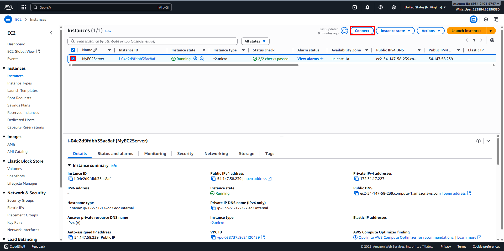
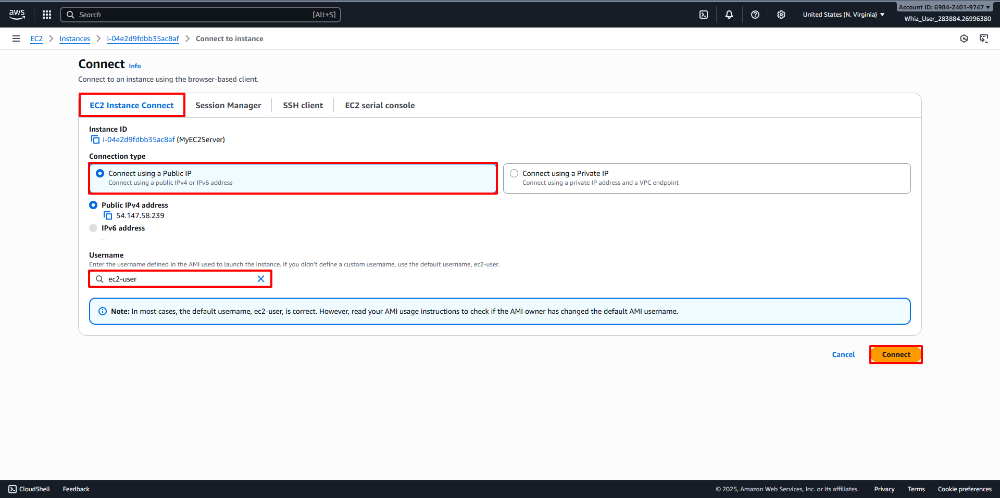
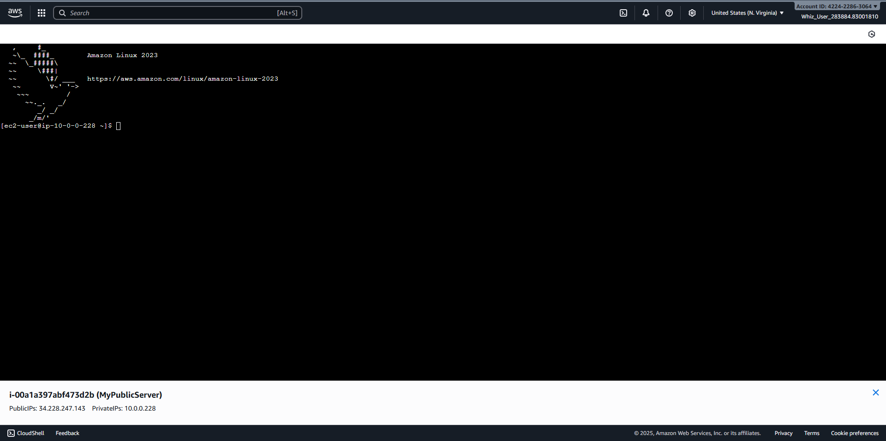

# SSH into EC2 Instance using the key pair
##
Connect to Public Server
1. Back to Instances Dashboard, then select your Created Instance before (For example MyPublicServer).
2. Click on Connect button. 
3. Then select EC2 Instance Connect option.
4. Choose Connect using a Public IP on Connection Type option.
5. Username: Type desired username for SSH login (For example ec2-user)
6. Click on Connect button. 
7. Then new tab will opened the console. 