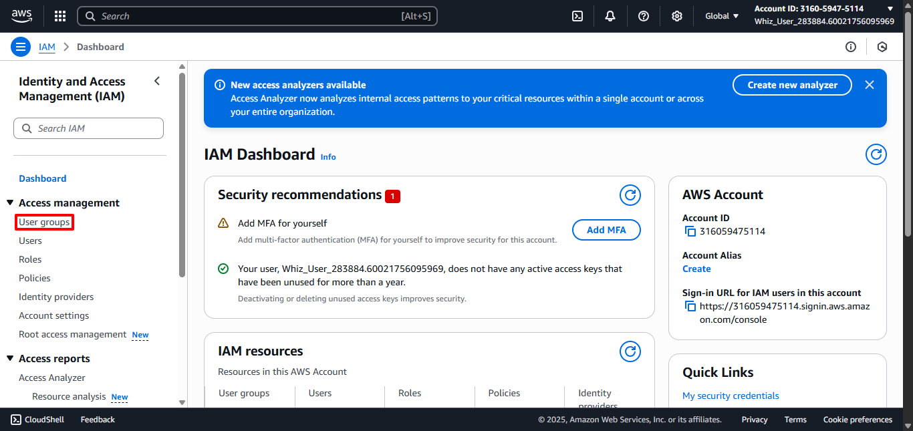
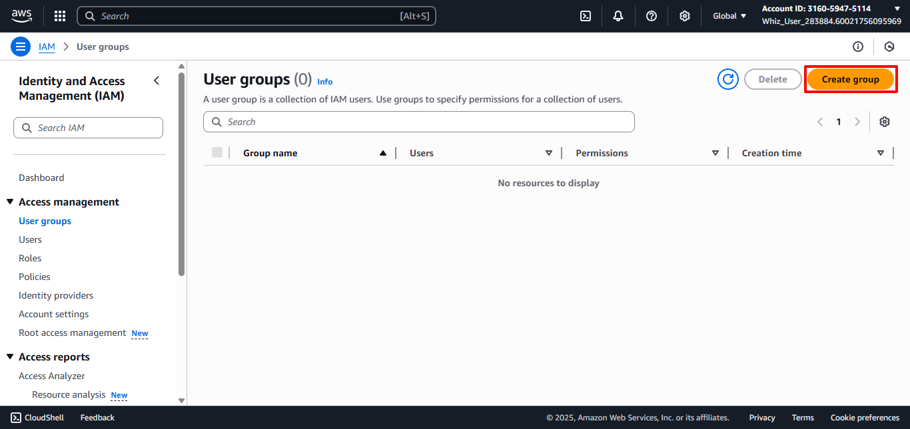
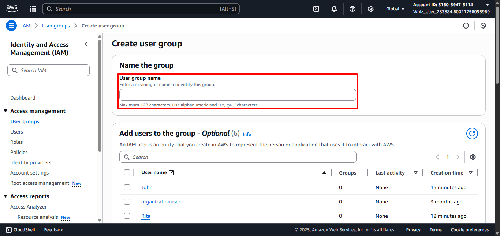
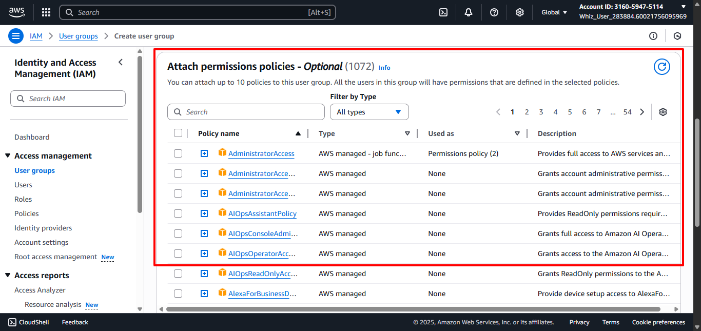
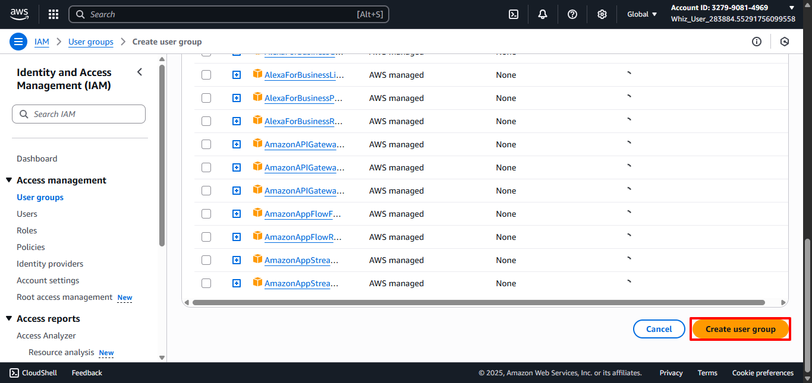
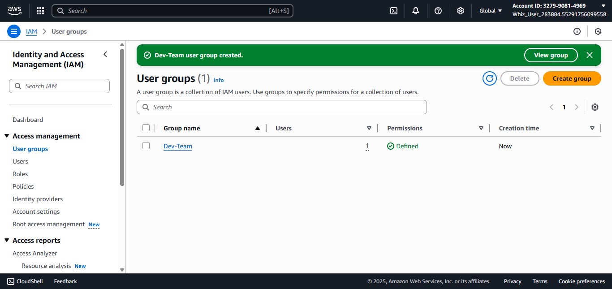

# Create IAM Group
##
1. Back to IAM Dashboard then select the User Groups in the left panel. 
2. Click on the Create Group button. 
3. Set the Group Name.
   - User Group Name: Enter desired group name. (For example Dev-Team) 
   - Add User to the Group: Select Users to be Added to the Group. (For example John) 
   - Attach Permissions Policies: Select the policies to grant access for the Users. (For example AmazonEC2ReadOnlyAccess) 
   - Click Create User Group button. 
4. User Group done created. 
