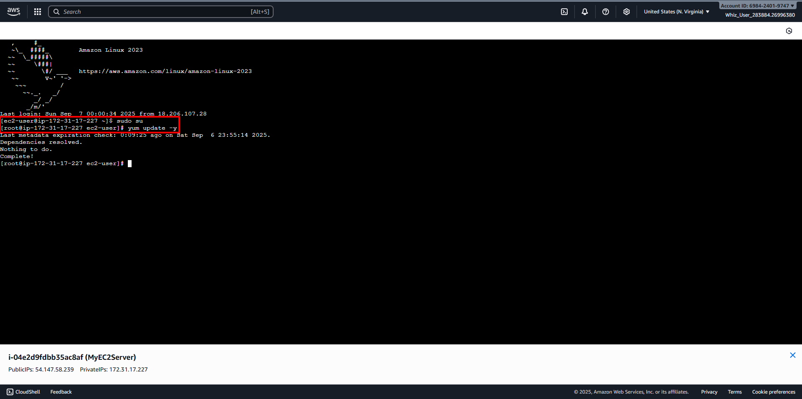
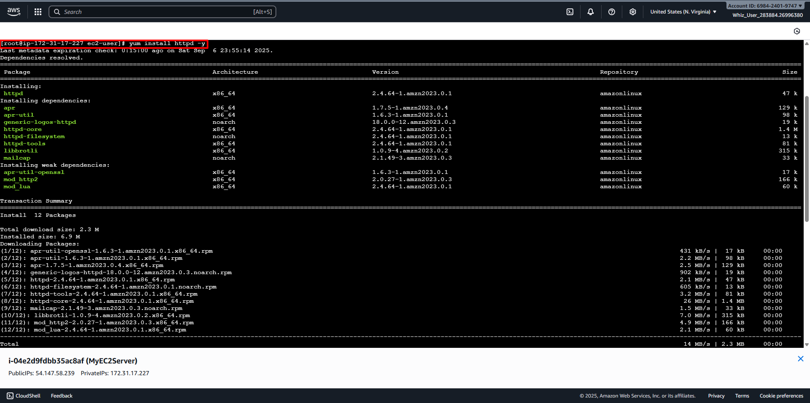
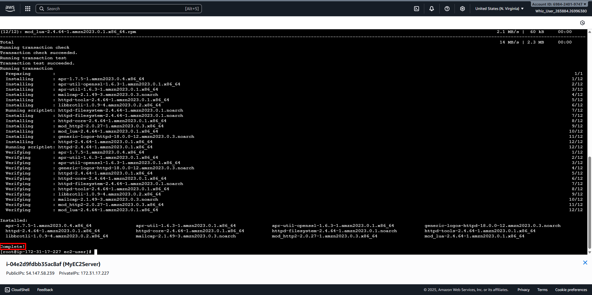
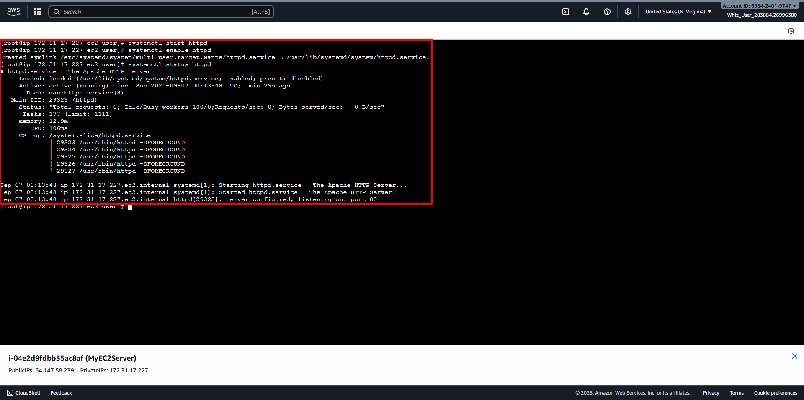

# Install an Apache Server on the instance
##
1. Switch to Root User.
``` bash
sudo su
```
2. Update the installed packages on your instance.
``` bash
yum update -y
```

3. Install Apache web server on your instance.
``` bash
yum install httpd -y
```

Wait until status Completed.

4. Start the Apache web server.
``` bash
systemctl start httpd
```
5. Enable Apache to start on boot.
``` bash
systemctl enable httpd
```
6. Check the status of Apache web server to ensure it is running.
``` bash
systemctl status httpd
```
