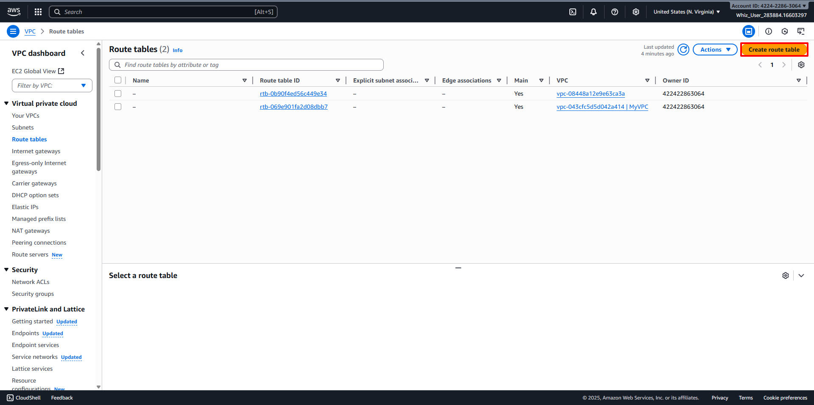
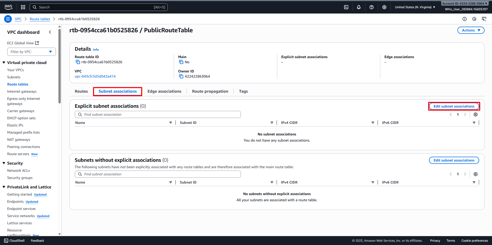
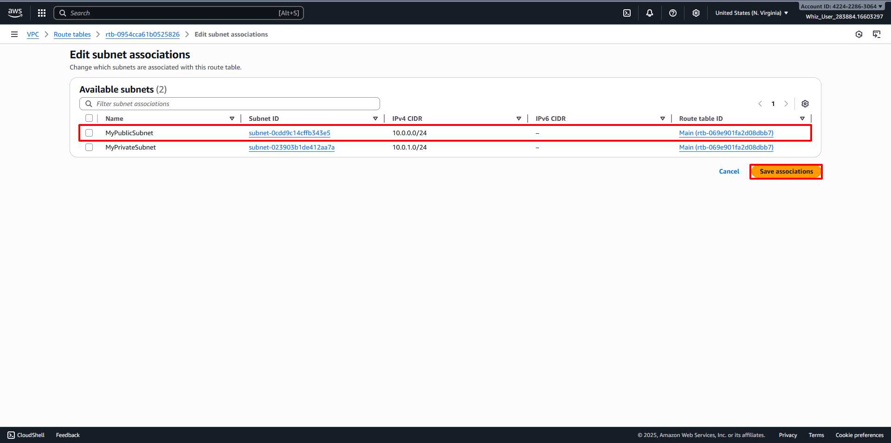
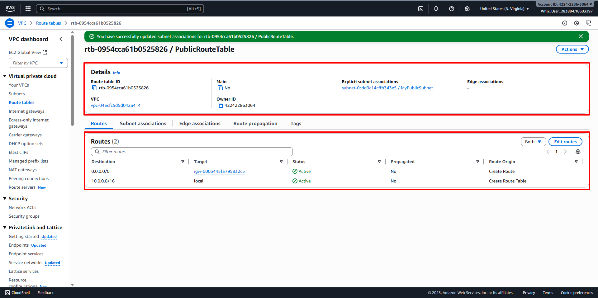

# Create Public Route Table and Configure
##
1. Back to the VPC Dashboard, then navigate to Route Tables in the left panel. 
2. Click on the Create Route Table button. 
   - Name: Enter desired name for Route Table (For example PublicRouteTable).
   - VPC: Select desired VPC (For example MyVPC).
   - Click on Create Route Table. 
3. Attach an Internet Gateway to the Route Table.
   - In the Routes Tab, click on Edit Routes. 
   - Click Add Route:
     [] Destination: Enter desired IP Address range (CIDR block) that traffic is intended for (For example 0.0.0.0/0).
     [] Target: Select Internet Gateway, then choose your desired Internet Gateway (For example MyIGW).
     [] Click on Save Changes. 
4. Associate Public Subnet to the Route Table:
   - In the Subnet Associations Tab, click on Edit Subnet Associations. 
   - Select your desired Subnet (For example MyPublicSubnet).
   - Then click on Save Associations button. 
5. Once all the configurations are completed, it should look like below:
   - Now the Instances launched within MyPublicSubnet will have access to the Internet.
   - There is another existing route table already available for MyVPC. It is the main route table created at the time the VPC was created. We will use it while creating the NAT Gateway. 
