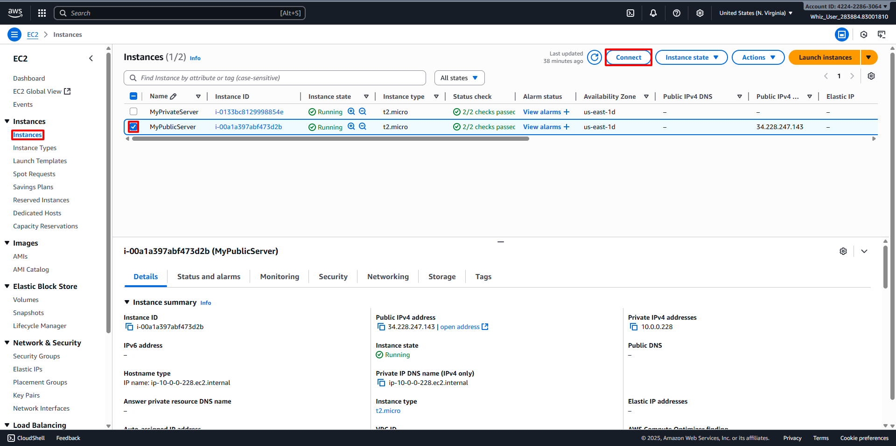
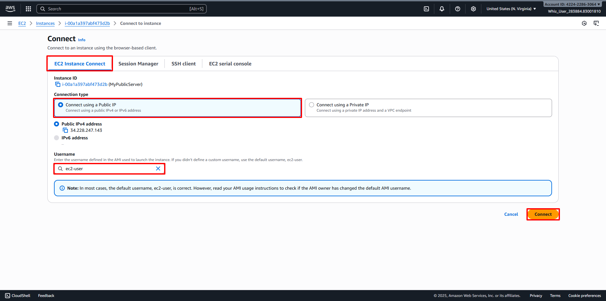
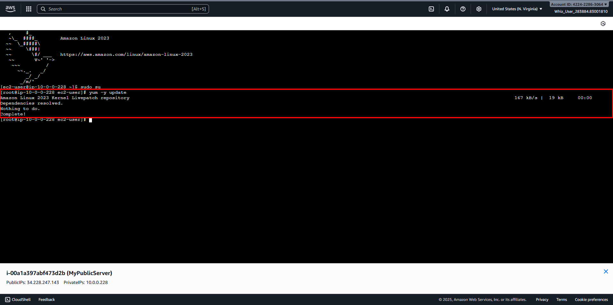
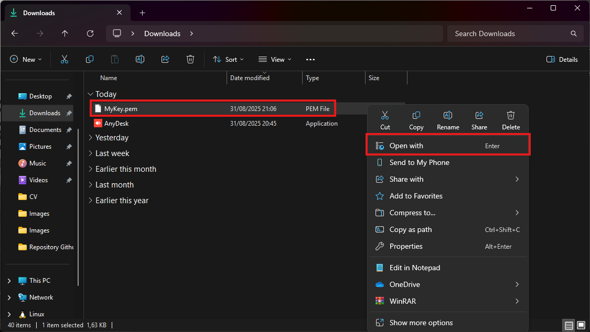
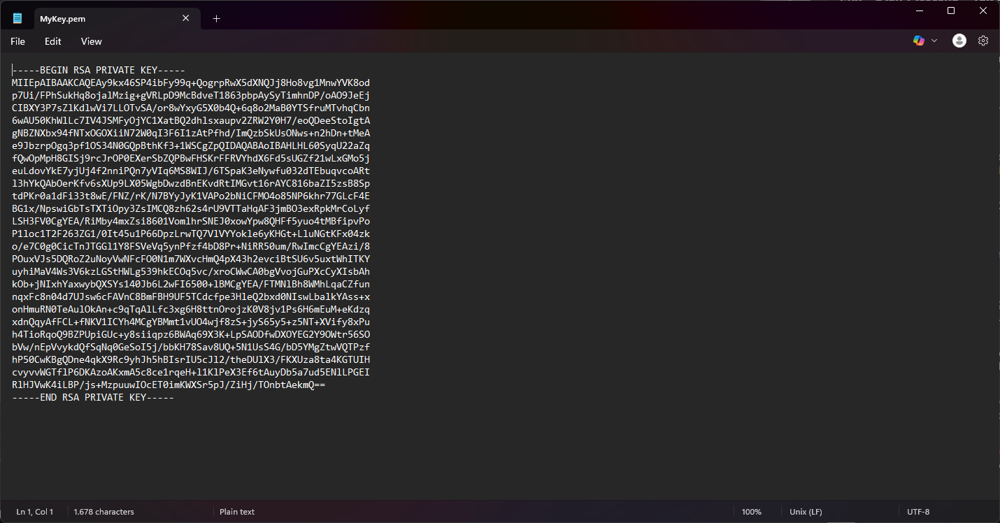
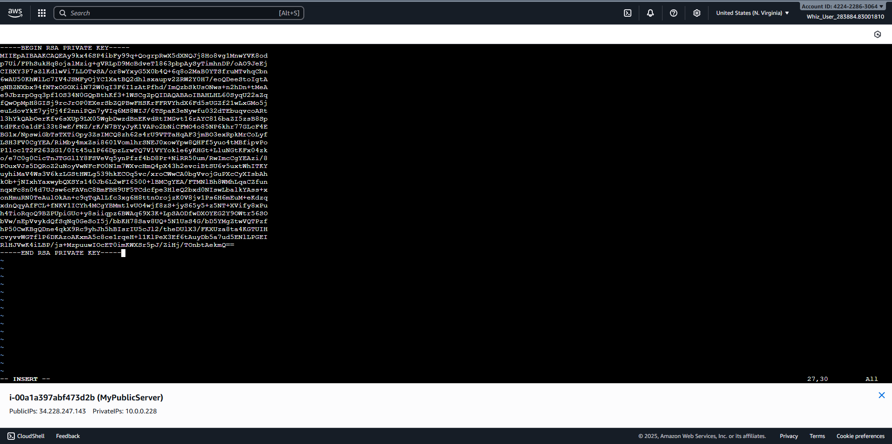
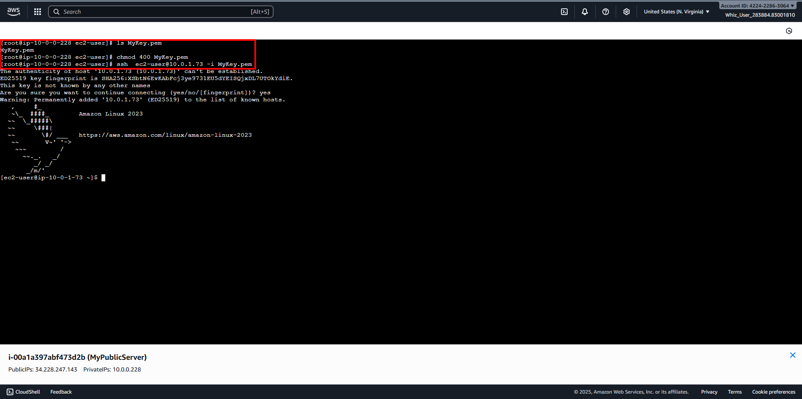
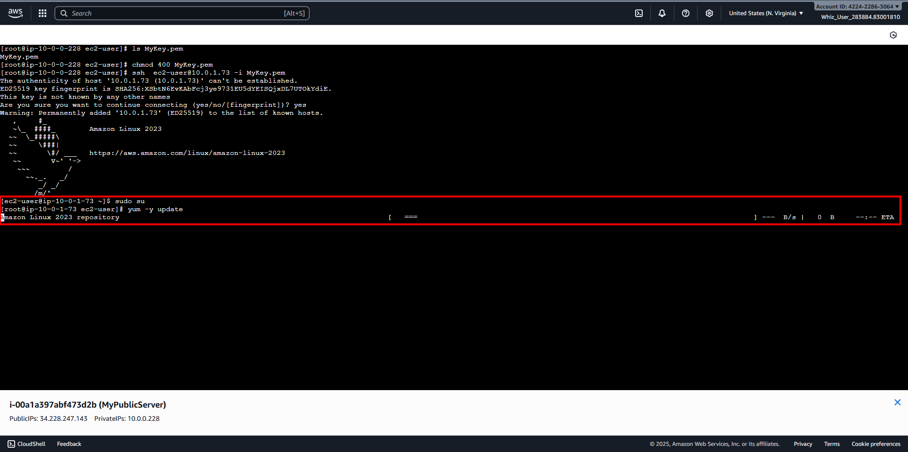

# SSH into Public and Private EC2 Instance and Test Internet Connectivity
##
Connect to Public Server
1. Back to Instances Dashboard, then select your Created Instance before (For example MyPublicServer).
2. Click on Connect button. 
3. Then select EC2 Instance Connect option.
4. Choose Connect using a Public IP on Connection Type option.
5. Username: Type desired username for SSH login (For example ec2-user)
6. Click on Connect button. 
7. Then new tab will opened the console. 
8. Switch to Root User.
```bash
sudo su
```
9. Run the updates.
```bash
yum -y update
```
10. Since the Internet Gateway MyIGW is connected to MyPublicSubnet, updates will be completed successfully. 
##
Connect to Private Server from Public Server SSH.
1. Create the MyKey.pem in MyPublicEC2Server.
```bash
vi MyKey.pem
```
2. Open your downloaded MyKey.pem with text editor.
   - Find your MyKey.pem directory.
   - Press right click on your mouse, the choose Open With button. 
   - Choose your text editor app for opening .pem file (For example using Notepad).
   - Then click on Just Once button. 
   - Your MyKey.pem file will open. 
3. Copy the entire character on MyKey.pem.
4. Back to console, then press "I" to inserting data to MyKey.pem on console.
5. Paste to MyKey.pem on console. 
6. Save the file, press "Esc" then type
```bash
:wq
```
7. Check that the file was created correctly.
```bash
ls MyKey.pem
```
8. Update Permissions for the MyKey.pem
```bash
chmod 400 MyKey.pem
```
9. Use the Private IP address of MyPrivateEC2Server to Connect SSH (For example 10.0.1.73).
```bash
ssh  ec2-user@<Private IP of MyPrivateEC2Server> -i MyKey.pem
```

10. Switch to Root User.
```bash
sudo su
```
11. Run the updates.
```bash
yum -y update
```
12. Since no internet access is provided for EC2 instances in a private subnet, you will not be able to get updates. 
